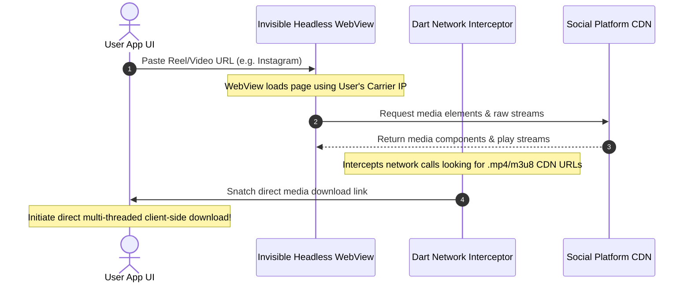

# LoopHole V2.0 Architecture Roadmap: Client-Side WebView Network Interception

This design document outlines the technical specifications, flow sequences, and structural implementation details for transitioning LoopHole's Instagram, Facebook, and Pinterest scrapers to **decentralized client-side WebView network interception**.

---

## 🧭 Architectural Vision

The ultimate goal for V2.0 is to **eliminate backend server costs completely** and achieve **100% immunity to IP bans**. By executing the rendering of pages on the client's actual device and intercepting the network calls, we mimic natural human browsing and leverage their local residential/carrier IP address.



---

## 🛠️ Key Components & Native Bridges

To intercept secure HTTPS network requests inside a mobile application, we will utilize native system Bridges in both Flutter and the platform web engines.

### 1. The Headless Web Engine (Flutter)
We will use the **`flutter_inappwebview`** package, which provides granular controls over the underlying native OS WebViews (`WKWebView` on iOS and `WebView` on Android).

### 2. Request & Response Interception
*   **Web Resource Requests**: We will hook into the `shouldInterceptRequest` (Android) and custom URL schemes (iOS) to capture background file requests before they are loaded.
*   **DOM Injection (JavaScript)**: We will inject a lightweight JS script at the earliest stage (`document_start`) to hook into `window.fetch` and `XMLHttpRequest` to capture AJAX and GraphQL data packets returned by the Meta/Instagram servers.

---

## 📝 Conceptual Code Draft (Flutter/Dart)

Here is the architectural blueprint of the V2.0 client-side scraper class:

```dart
import 'package:flutter_inappwebview/flutter_inappwebview.dart';

class ClientSideScraper {
  HeadlessInAppWebView? _headlessWebView;
  
  Future<String?> scrapeInstagramVideo(String reelUrl) async {
    final String? directStreamUrl = await _initiateNetworkInterception(
      url: reelUrl,
      filterPattern: r"scontent\.cdninstagram\.com.*\.mp4",
      jsHookCode: """
        // Intercept modern AJAX requests
        const originalFetch = window.fetch;
        window.fetch = async function(...args) {
          const response = await originalFetch.apply(this, args);
          const clone = response.clone();
          clone.text().then(body => {
            if (body.includes("video_versions") || body.includes("direct_download_url")) {
              console.log("GraphQL_Intercepted:" + body);
            }
          });
          return response;
        };
      """
    );
    
    return directStreamUrl;
  }

  Future<String?> _initiateNetworkInterception({
    required String url,
    required String filterPattern,
    required String jsHookCode,
  }) async {
    final regex = RegExp(filterPattern);
    String? matchedUrl;
    
    _headlessWebView = HeadlessInAppWebView(
      initialUrlRequest: URLRequest(url: WebUri(url)),
      initialSettings: InAppWebViewSettings(
        userAgent: "Mozilla/5.0 (iPhone; CPU iPhone OS 16_6 like Mac OS X) AppleWebKit/605.1.15 (KHTML, like Gecko) Version/16.6 Mobile/15E148 Safari/604.1",
        javaScriptEnabled: true,
        mediaPlaybackRequiresUserGesture: false,
      ),
      onLoadStart: (controller, url) async {
        // Inject JS hook to capture fetch and graphql responses
        await controller.evaluateJavascript(source: jsHookCode);
      },
      onLoadResource: (controller, resource) {
        final requestUrl = resource.url.toString();
        if (regex.hasMatch(requestUrl)) {
          matchedUrl = requestUrl;
          _cleanup(); // Immediately kill the webview once found
        }
      },
    );

    await _headlessWebView?.run();
    
    // Polling/Timeout mechanism to wait for url extraction
    int timeout = 0;
    while (matchedUrl == null && timeout < 30) {
      await Future.delayed(const Duration(milliseconds: 500));
      timeout++;
    }
    
    return matchedUrl;
  }
  
  void _cleanup() {
    _headlessWebView?.dispose();
    _headlessWebView = null;
  }
}
```

---

## 🏆 Mitigation for Edge Cases & Fallbacks

### 1. Handling Meta Login Walls (Self-Healing Auth)
> [!NOTE]
> If a cookie session expires, Meta will redirect the WebView to the `/accounts/login/` page.
*   **Solution**: Instead of crashing, the app will display a beautiful, secure slide-up bottom sheet containing the native WebView. The user logs into Instagram once. All session cookies are automatically persisted in the native iOS `HTTPCookieStore` and Android `CookieManager` vaults.
*   **Security Benefit**: LoopHole does not touch, see, or transmit user credentials. The user's account session stays local to their device.

### 2. Handling Slow Connections / Resource Caps
*   **Resource Throttling**: To prevent slow loads and battery drain, we block the loading of heavy secondary assets (such as CSS stylesheets, image fonts, advertising tracking scripts, and analytics).
*   **Implementation**: Use the `shouldInterceptRequest` callback to return empty `WebResourceResponse` packages for unwanted assets.

---

## 📅 V2.0 Implementation Phases

| Phase | Milestone | Focus Areas |
| :--- | :--- | :--- |
| **Phase 1** | **PoC Development** | Integrate `flutter_inappwebview` and design JS interception scripts. |
| **Phase 2** | **Native Performance** | Profile memory/CPU usage of headless engines; implement resource filters. |
| **Phase 3** | **Self-Healing UI** | Build slide-up bottom sheets for user authentication and login wall handling. |
| **Phase 4** | **Server Demolition** | Fully cut off the Render backend for Instagram, Facebook, and Pinterest. |

---
